# OFX Architecture

This document summarizes the current OFX integration as implemented in the C++ plugin, the Rust FFI bridge, and the upstream OpenDefocus core.

## 1. Project Architecture

```mermaid
flowchart LR
  Host["OFX Host<br/>Nuke / Flame / Resolve<br/>OFX actions and clip scheduling"]

  subgraph CPP["C++ Plugin Layer"]
    CPP1["OpenDefocusPlugin<br/>describe(), changedParam(), render()"]
    CPP2["Fetch OFX clips and params<br/>build fetchWindow and host-side buffers<br/>copy final pixels back to dst"]
  end

  subgraph FFI["FFI Boundary"]
    FFI1["opendefocus_ofx_bridge.h<br/>opaque OdHandle<br/>extern C ABI"]
  end

  subgraph Bridge["Rust Bridge Layer"]
    RB1["OdInstance<br/>settings + renderer + tokio runtime + gpu_failed"]
    RB2["od_set_* setters<br/>od_set_use_gpu()<br/>od_render() stripe orchestration"]
  end

  subgraph Core["Rust Core Layer"]
    RC1["OpenDefocusRenderer<br/>select SharedRunner"]
    RC2["RenderEngine<br/>filter/depth prep<br/>ChunkHandler + render_convolve"]
  end

  subgraph Backends["Execution Backends"]
    SR["SharedRunner"]
    GPU["WgpuRunner<br/>WGSL compute pipeline<br/>textures, buffers, staging copy"]
    CPU["CpuRunner<br/>rayon parallel loop<br/>global_entrypoint()"]
    Kernel["Shared kernel logic<br/>opendefocus-kernel + opendefocus_shared"]
  end

  Host --> CPP1 --> CPP2 --> FFI1 --> RB1 --> RB2 --> RC1 --> RC2 --> SR
  SR --> GPU
  SR --> CPU
  GPU --> Kernel
  CPU --> Kernel
```

Relevant files:

- `plugin/OpenDefocusOFX/src/OpenDefocusOFX.cpp`
- `rust/opendefocus-ofx-bridge/include/opendefocus_ofx_bridge.h`
- `rust/opendefocus-ofx-bridge/src/lib.rs`
- `upstream/opendefocus/crates/opendefocus/src/lib.rs`
- `upstream/opendefocus/crates/opendefocus/src/worker/engine.rs`
- `upstream/opendefocus/crates/opendefocus/src/runners/shared_runner.rs`
- `upstream/opendefocus/crates/opendefocus/src/runners/cpu.rs`
- `upstream/opendefocus/crates/opendefocus/src/runners/wgpu.rs`

## 2. Rendering Pipeline

```mermaid
flowchart TD
  H["OFX host calls OpenDefocusPlugin::render(args)"]
  V{"Valid dst/src and non-empty render window?"}
  E["Throw OFX error or return"]
  I{"No Rust handle or Size <= 0?"}
  Pass["Memcpy src -> dst<br/>pass-through"]
  P["Read OFX params<br/>apply renderScale<br/>od_set_use_gpu() + od_set_*"]
  Prev{"Filter preview path?"}
  PrevBuf["Build previewBuf<br/>force 2D + preview resolution"]
  Build["Compute fetchWindow<br/>expand Y by blur margin<br/>use full buffer width"]
  Src["Copy source into imageBuffer<br/>ClampToEdge padding"]
  Dep{"Depth mode and depth clip?"}
  DepBuf["Copy depth into depthBuffer<br/>ClampToEdge padding"]
  Fil{"Filter Type = Image and filter clip connected?"}
  FilBuf["Copy filter clip into filterBuffer"]
  Geo["Set focus plane and defocus mode<br/>set resolution, center, fullRegion, renderRegion"]
  Call["Call od_render()<br/>with previewBuf or imageBuffer"]

  subgraph Bridge["Rust FFI Bridge: od_render()"]
    R0["Validate pointers and regions<br/>build filter template<br/>clear abort flag"]
    R1{"gpu_failed while renderer is still GPU?"}
    R1A["Recreate CPU renderer before rendering"]
    R2["Choose stripe_h<br/>preview = full height, focal setup = 32<br/>CPU = 256, GPU = 128/256 by quality<br/>padding = defocus padding + 4"]
    R3["Clone source_image snapshot<br/>pre-allocate reusable stripe_buf"]
    R4{"More stripes in render_region?"}
    R4A{"Abort requested?<br/>global flag or host callback"}
    R5["Reuse stripe_buf and stripe_depth<br/>compute y_in/y_out and stripe_specs"]
    R6{"First GPU stripe?"}
    R7["render_stripe() inside catch_unwind"]
    R8{"GPU stripe succeeded?"}
    R9["Mark gpu_failed<br/>recreate CPU renderer<br/>retry same stripe on CPU"]
    R10["render_stripe() with current renderer"]
    R11["Copy only stripe render_region<br/>back into the active output buffer"]
  end

  subgraph Core["Rust Core: render_stripe() -> RenderEngine"]
    C1["Validate settings<br/>depth/filter/result-mode checks"]
    C2{"settings.render.filter.preview?"}
    C2A["render_preview_bokeh()<br/>fill stripe buffer directly"]
    C3["prepare_filter_image()<br/>prepare_depth_map()"]
    C4{"FocalPlaneSetup preview?"}
    C4A["render_focal_plane_preview()<br/>return overlay"]
    C5["Create filter mipmaps when needed<br/>ChunkHandler(limit = 4096, padding)"]
    C6["For each chunk<br/>slice image/depth views"]
    C7["render_convolve()<br/>normalize to 4 channels<br/>build inpaint + depth pair<br/>allocate output_image_data"]
    C8["runner.convolve()<br/>settings_to_convolve_settings<br/>cached sample weights"]
    C9{"Backend"}
    C10["WgpuRunner<br/>upload textures and buffers<br/>dispatch WGSL compute shader<br/>copy output buffer -> staging -> host slice"]
    C11["CpuRunner<br/>rayon par_chunks loop<br/>global_entrypoint() per pixel"]
    C12["Blend back into chunk image<br/>output + original * (1 - alpha)"]
  end

  AbortFix["If od_render() returns ABORTED<br/>repopulate imageBuffer from pristine source"]
  Post["C++ post-process after od_render returns<br/>previewBuf: clear dst + center-copy<br/>imageBuffer: copy intersection + overscan edge replicate"]
  Ok["render() returns to host"]

  H --> V
  V -- "no" --> E
  V -- "yes" --> I
  I -- "yes" --> Pass --> Ok
  I -- "no" --> P --> Prev
  Prev -- "yes" --> PrevBuf --> Call
  Prev -- "no" --> Build --> Src --> Dep
  Dep -- "yes" --> DepBuf --> Fil
  Dep -- "no" --> Fil
  Fil -- "yes" --> FilBuf --> Geo
  Fil -- "no" --> Geo
  Geo --> Call

  Call --> R0 --> R1
  R1 -- "yes" --> R1A --> R2
  R1 -- "no" --> R2
  R2 --> R3 --> R4
  R4 -- "yes" --> R4A
  R4A -- "yes" --> AbortFix
  R4A -- "no" --> R5 --> R6
  R6 -- "yes" --> R7 --> R8
  R8 -- "yes" --> C1
  R8 -- "no" --> R9 --> C1
  R6 -- "no" --> R10 --> C1

  C1 --> C2
  C2 -- "yes" --> C2A --> R11
  C2 -- "no" --> C3 --> C4
  C4 -- "yes" --> C4A --> R11
  C4 -- "no" --> C5 --> C6 --> C7 --> C8 --> C9
  C9 --> C10 --> C12 --> R11
  C9 --> C11 --> C12 --> R11

  R11 --> R4
  R4 -- "no" --> Post
  AbortFix --> Post

  Post --> Ok
```

Relevant files:

- `plugin/OpenDefocusOFX/src/OpenDefocusOFX.cpp`
- `rust/opendefocus-ofx-bridge/src/lib.rs`
- `upstream/opendefocus/crates/opendefocus/src/lib.rs`
- `upstream/opendefocus/crates/opendefocus/src/worker/engine.rs`
- `upstream/opendefocus/crates/opendefocus/src/worker/chunks.rs`
- `upstream/opendefocus/crates/opendefocus/src/runners/runner.rs`
- `upstream/opendefocus/crates/opendefocus/src/runners/cpu.rs`
- `upstream/opendefocus/crates/opendefocus/src/runners/wgpu.rs`

## 3. Current Behavior Notes

- C++ no longer caps `bufWidth` to `4096`. The full `fetchWindow` width is used, and stripe splitting keeps each stripe buffer under the wgpu storage-buffer limit.
- Rust still uses the upstream `ChunkHandler(limit = 4096)` inside `RenderEngine`, so images wider than `4096px` can still hit the upstream horizontal chunk path and its known seam issue.
- Abort handling is coarse-grained: the host `abort()` state is queried between stripes via the FFI callback. If abort is detected, Rust returns `ABORTED`, C++ restores pristine source pixels into `imageBuffer`, and the normal overscan-safe dst copy path writes an unprocessed frame.
- Filter Preview is only enabled for `Disc` and `Blade`. In Rust, preview renders use full-height stripe size to bypass stripe splitting and avoid preview seams.
- Phase D reduced stripe overhead by reusing a pre-allocated `stripe_buf`, but each render still clones the full source image once because the upstream render API requires mutable ownership of the working image buffer.
