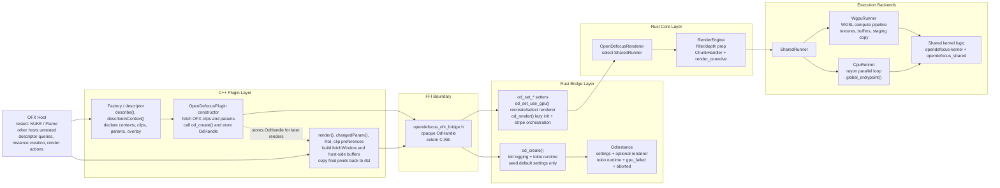

# OFX Architecture

This document summarizes the current OFX integration as implemented in the C++ plugin, the Rust FFI bridge, and the upstream OpenDefocus core.

It reflects the current `master` implementation (`v0.1.10-OFX-v5-dev`) including lazy renderer initialization, draft-render optimization, Phase E coordinate-system fixes, review fixes (Depth fetch guard, RoI X overscan removal), Fusion Studio compatibility work (`catch_unwind`, OpenGL link), Windows build support, thread safety upgrade (`eRenderInstanceSafe`), LTO optimization, and P0 stability fixes (per-instance abort, GPU toggle, depth fetch throttling).

## 1. Project Architecture

Relevant files:

- `plugin/OpenDefocusOFX/src/OpenDefocusOFX.cpp`
- `rust/opendefocus-ofx-bridge/include/opendefocus_ofx_bridge.h`
- `rust/opendefocus-ofx-bridge/src/lib.rs`
- `upstream/opendefocus/crates/opendefocus/src/lib.rs`
- `upstream/opendefocus/crates/opendefocus/src/worker/engine.rs`
- `upstream/opendefocus/crates/opendefocus/src/runners/shared_runner.rs`
- `upstream/opendefocus/crates/opendefocus/src/runners/cpu.rs`
- `upstream/opendefocus/crates/opendefocus/src/runners/wgpu.rs`

## 2. Host, Context, and Initialization Behavior

- The validated host matrix in the repo docs is **NUKE** and **Flame**. In code, only Flame gets a dedicated UI topology path; all non-Flame hosts share the generic descriptor layout.
- `describeInContext()` branches UI/layout by `hostName`: Flame uses split subgroup columns, while NUKE, Resolve, Fusion, and other non-Flame hosts use the flat 4-page layout. This is a UI branch, not a render backend branch.
- The descriptor currently advertises both `eContextGeneral` and `eContextFilter`.
- `Source` and `Output` clips are defined in all contexts. `Depth` and `Filter` clips are defined only in `eContextGeneral`.
- The plugin constructor currently calls `fetchClip()` for `Source`, `Depth`, `Filter`, and `Output` unconditionally, then calls `od_create()` immediately.
- `od_create()` initializes Rust logging, creates a Tokio runtime, and seeds default settings, but leaves `renderer: None`. The actual renderer is created lazily on first `od_render()` or explicit `od_set_use_gpu()`.
- On macOS + NUKE, `Use Focus Point` and `Focus Point XY` are hidden/disabled because the overlay interact path is disabled there. Flame macOS keeps them enabled.
- This partial `eContextFilter` contract, together with eager clip fetching in the constructor, is architecturally important when debugging host startup or plugin-load failures on stricter OFX hosts.

Relevant files:

- `plugin/OpenDefocusOFX/src/OpenDefocusOFX.cpp`
- `rust/opendefocus-ofx-bridge/src/lib.rs`
- `README_OFX.md`
- `HISTORY_DEV_en.md`

## 3. Rendering Pipeline

```mermaid
flowchart TD
  H["OFX host calls OpenDefocusPlugin::render(args)"]
  V{"Valid dst/src and non-empty render window?"}
  E["Throw OFX error or return"]
  I{"No Rust handle or Size <= 0?"}
  Pass["Memcpy src -> dst<br/>pass-through"]
  P["Read OFX params<br/>draft renders force low quality + fewer samples<br/>apply renderScale.x and od_set_*"]
  Prev{"Filter preview path?"}
  PrevBuf["Build previewBuf<br/>force 2D + preview resolution"]
  Build["Compute fetchWindow<br/>expand Y by blur margin only<br/>use full buffer width"]
  Src["Copy source into imageBuffer<br/>ClampToEdge padding"]
  Dep{"Mode = Depth and depth clip connected?"}
  DepBuf["Copy depth into depthBuffer<br/>ClampToEdge padding"]
  Fil{"Filter Type = Image and filter clip connected?"}
  FilBuf["Copy filter clip into filterBuffer"]
  Geo["Get source RoD<br/>set focus plane and defocus mode<br/>set resolution, center (RoD-local)<br/>set fullRegion/renderRegion (RoD-based)"]
  Call["Call od_render()<br/>with previewBuf or imageBuffer"]

  subgraph Bridge["Rust FFI Bridge: od_render()"]
    R0["Validate pointers and regions<br/>build filter template<br/>clear abort flags"]
    R0A{"renderer is None?"}
    R0B["ensure_renderer()<br/>lazy-create renderer from current GPU setting"]
    R1{"gpu_failed while renderer is still GPU?"}
    R1A["Recreate CPU renderer before rendering"]
    R2["Choose stripe_h<br/>preview = full height, focal setup = 32<br/>CPU = 256, GPU = 128/256 by quality<br/>padding = defocus padding + 4"]
    R3["Clone source_image snapshot<br/>pre-allocate reusable stripe_buf"]
    R4{"More stripes in render_region?"}
    R4A{"Abort requested?<br/>instance/global abort sync or host callback"}
    R5["Reuse stripe_buf<br/>rebuild stripe_depth as needed<br/>compute y_in/y_out and stripe_specs<br/>full_region.y = absolute stripe Y"]
    R6{"First GPU stripe?"}
    R7["render_stripe() inside catch_unwind"]
    R8{"GPU stripe succeeded?"}
    R9["Mark gpu_failed<br/>recreate CPU renderer<br/>retry same stripe on CPU"]
    R10["render_stripe() with current renderer"]
    R11["Copy only stripe render_region<br/>back into the active output buffer"]
  end

  subgraph Core["Rust Core: render_stripe() -> RenderEngine"]
    C1["Validate settings<br/>depth/filter/result-mode checks"]
    C2{"settings.render.filter.preview?"}
    C2A["render_preview_bokeh()<br/>fill stripe buffer directly"]
    C3["prepare_filter_image()<br/>prepare_depth_map()"]
    C4{"FocalPlaneSetup preview?"}
    C4A["render_focal_plane_preview()<br/>return overlay"]
    C5["Create filter mipmaps when needed<br/>ChunkHandler(limit = 4096, padding)"]
    C6["For each chunk<br/>slice image/depth views"]
    C7["render_convolve()<br/>normalize to 4 channels<br/>build inpaint + depth pair<br/>allocate output_image_data"]
    C8["runner.convolve()<br/>settings_to_convolve_settings<br/>cached sample weights"]
    C9{"Backend"}
    C10["WgpuRunner<br/>upload textures and buffers<br/>dispatch WGSL compute shader<br/>copy output buffer -> staging -> host slice"]
    C11["CpuRunner<br/>rayon par_chunks loop<br/>global_entrypoint() per pixel"]
    C12["Blend back into chunk image<br/>output + original * (1 - alpha)"]
  end

  AbortFix["If od_render() returns ABORTED<br/>repopulate imageBuffer from pristine source"]
  Post["C++ post-process after od_render returns<br/>previewBuf: clear dst + center-copy<br/>imageBuffer: copy intersection + overscan edge replicate"]
  Ok["render() returns to host"]

  H --> V
  V -- "no" --> E
  V -- "yes" --> I
  I -- "yes" --> Pass --> Ok
  I -- "no" --> P --> Prev
  Prev -- "yes" --> PrevBuf --> Call
  Prev -- "no" --> Build --> Src --> Dep
  Dep -- "yes" --> DepBuf --> Fil
  Dep -- "no" --> Fil
  Fil -- "yes" --> FilBuf --> Geo
  Fil -- "no" --> Geo
  Geo --> Call

  Call --> R0 --> R0A
  R0A -- "yes" --> R0B --> R1
  R0A -- "no" --> R1
  R1 -- "yes" --> R1A --> R2
  R1 -- "no" --> R2
  R2 --> R3 --> R4
  R4 -- "yes" --> R4A
  R4A -- "yes" --> AbortFix
  R4A -- "no" --> R5 --> R6
  R6 -- "yes" --> R7 --> R8
  R8 -- "yes" --> C1
  R8 -- "no" --> R9 --> C1
  R6 -- "no" --> R10 --> C1

  C1 --> C2
  C2 -- "yes" --> C2A --> R11
  C2 -- "no" --> C3 --> C4
  C4 -- "yes" --> C4A --> R11
  C4 -- "no" --> C5 --> C6 --> C7 --> C8 --> C9
  C9 --> C10 --> C12 --> R11
  C9 --> C11 --> C12 --> R11

  R11 --> R4
  R4 -- "no" --> Post
  AbortFix --> Post

  Post --> Ok
```

Relevant files:

- `plugin/OpenDefocusOFX/src/OpenDefocusOFX.cpp`
- `rust/opendefocus-ofx-bridge/src/lib.rs`
- `upstream/opendefocus/crates/opendefocus/src/lib.rs`
- `upstream/opendefocus/crates/opendefocus/src/worker/engine.rs`
- `upstream/opendefocus/crates/opendefocus/src/worker/chunks.rs`
- `upstream/opendefocus/crates/opendefocus/src/runners/runner.rs`
- `upstream/opendefocus/crates/opendefocus/src/runners/cpu.rs`
- `upstream/opendefocus/crates/opendefocus/src/runners/wgpu.rs`

## 4. Current Behavior Notes

- Tested hosts in the repo docs are NUKE and Flame. Resolve and Fusion are not part of the validated host matrix, even though non-Flame hosts share the generic descriptor path.
- `describeInContext()` performs host-specific UI topology branching via `OFX::getImageEffectHostDescription()->hostName`: Flame gets split subgroup columns, while non-Flame hosts share the flat 4-page layout.
- On macOS + NUKE, `Use Focus Point` and `Focus Point XY` are hidden/disabled because the overlay interact path is disabled there.
- The plugin advertises `eContextGeneral` and `eContextFilter`, but `Depth` and `Filter` clips are only declared in `eContextGeneral`.
- The constructor still fetches `Depth` and `Filter` clips unconditionally and calls `od_create()` eagerly. This is a current compatibility risk for hosts that instantiate or validate plugins strictly during startup scan.
- `od_create()` creates the Tokio runtime and default settings, but does not create the renderer. Renderer creation is deferred to the first `od_render()` or an explicit `od_set_use_gpu()` call.
- GPU mode toggling now happens in `changedParam()` via `od_set_use_gpu()`. `render()` no longer recreates renderers on the hot path.
- Interactive or draft renders force `Quality = Low` and halve the sample count for faster feedback.
- C++ no longer caps `bufWidth` to `4096`. The full `fetchWindow` width is used, and stripe splitting keeps each stripe buffer under the wgpu storage-buffer limit.
- Rust still uses the upstream `ChunkHandler(limit = 4096)` inside `RenderEngine`, so images wider than `4096px` can still hit the upstream horizontal chunk path and its known seam issue.
- `render()` fetches `Depth` only in Depth mode. `getRegionsOfInterest()` also requests `Depth` only in Depth mode, avoiding unnecessary upstream evaluation in 2D mode and Filter Preview.
- RoI expands only in Y. X overscan is not requested because the render buffer uses render-window width and edge sampling is handled by ClampToEdge behavior.
- Geometry passed to Rust is RoD-based: `resolution` comes from source RoD, `center` is RoD-local, and stripe `full_region.y` carries absolute Y for position-dependent effects.
- The implementation uses `renderScale.x` only and assumes uniform render scale.
- Output RoD is pinned to the Source clip's RoD. `getClipPreferences()` mirrors source components, and mirrors bit depth / PAR when the host advertises those capabilities.
- Abort handling is coarse-grained: the host `abort()` state is queried between stripes via the FFI callback, while Rust keeps a per-instance abort flag and synchronizes the upstream global flag at render boundaries. If abort is detected, Rust returns `ABORTED`, C++ restores pristine source pixels into `imageBuffer`, and the normal overscan-safe dst copy path writes an unprocessed frame.
- Filter Preview is only enabled for `Disc` and `Blade`. In Rust, preview renders use full-height stripe size to bypass stripe splitting and avoid preview seams.
- Phase D reduced stripe overhead by reusing a pre-allocated `stripe_buf`, but each render still clones the full source image once because the upstream render API requires mutable ownership of the working image buffer.
